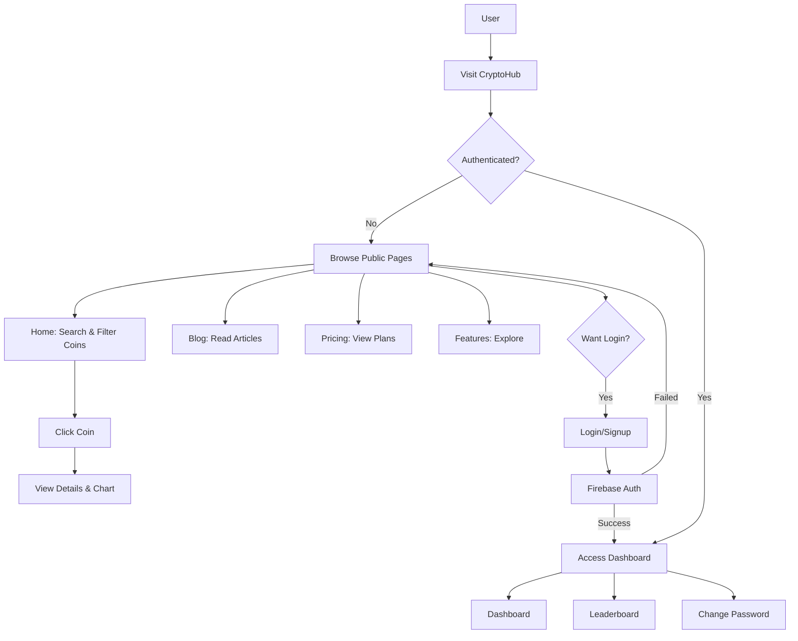
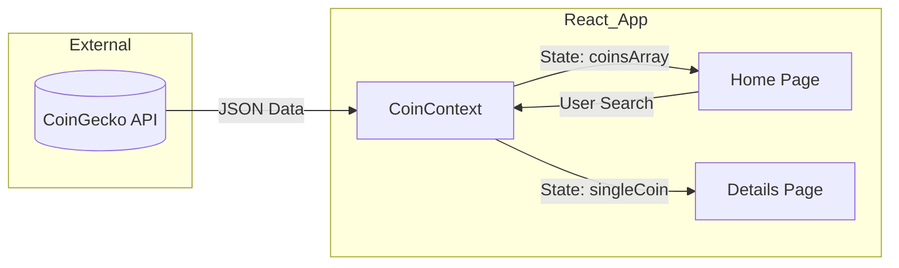

<div align="center">
  
</div>

<h1 align="center">CRYPTOHUB</h1>

<div align="center" style="margin: 10px 0 24px;">
  <a href="https://github.com/KaranUnique/CryptoHub/issues">🐛 Report Bug</a>
  •
  <a href="https://github.com/KaranUnique/CryptoHub/issues">💡 Request Feature</a>
  •
  <a href="https://crypto-hub-rosy.vercel.app">🌐 Live Demo</a>
</div>


## 📑 Table of Contents

- [🔍 Overview](#overview)
- [✨ Vision](#vision)
- [🎯 Why CryptoHub](#why-cryptohub)
- [🚀 Live Demo](#demo)
- [📸 Screenshots](#screenshots)
- [🌟 Key Features](#key-features)
  - [👤 User Features](#user-features)
  - [🔐 Authentication](#authentication)
  - [📊 Market Data](#market-data)
- [🛠️ Tech Stack](#tech-stack)
  - [Frontend](#frontend)
  - [Backend & Services](#backend--services)
  - [Styling & Design](#styling--design)
- [📊 Project Insights](#project-insights)
- [🧭 Project Flow](#project-flow)
- [⚙️ Installation and Setup](#installation-and-setup)
  - [📋 Prerequisites](#prerequisites)
  - [🔧 Environment Setup](#environment-setup)
  - [🏃 Running Locally](#running-locally)
- [📁 Project Structure](#project-structure)
- [👨‍💼 Project Leadership](#project-leadership)
- [✴️ Issue Creation](#issue-creation)
- [📑 Contribution Guidelines](#contribution-guidelines)
- [🤝 Contributing](#contributing)
  - [Ways to Contribute](#ways-to-contribute)
- [👥 Contributors](#contributors)
- [📋 Code of Conduct](#code-of-conduct)
- [💡 Suggestions & Feedback](#suggestions--feedback)
- [🙌 Show Your Support](#show-your-support)
- [📄 License](#license)
- [👨‍💼 Project Leadership](#project-leadership)
- [📞 Contact](#contact)
- [⭐ Stargazers](#stargazers)
- [🍴 Forkers](#forkers)


<h2 id="overview">🔍 Overview</h2>

> **CryptoHub** is a modern, fully responsive cryptocurrency dashboard built with React and Vite. It empowers users to track real-time crypto prices, analyze market trends through interactive charts, explore educational content, and manage their crypto portfolio—all in one beautifully designed platform.


<div align="center">
  
</div>


<h2 id="project-insights">📊 Project Insights</h2>

<table align="center">
    <thead align="center">
        <tr>
            <td><b>🌟 Stars</b></td>
            <td><b>🍴 Forks</b></td>
            <td><b>🐛 Issues</b></td>
            <td><b>🔔 Open PRs</b></td>
            <td><b>🔕 Closed PRs</b></td>
            <td><b>🛠️ Languages</b></td>
            <td><b>👥 Contributors</b></td>
        </tr>
     </thead>
    <tbody>
         <tr>
            <td></td>
            <td></td>
            <td></td>
            <td></td>
            <td></td>
            <td></td>
            <td></td>
        </tr>
    </tbody>
</table>


<h2 id="vision">✨ Vision</h2>

CryptoHub aims to democratize cryptocurrency information and make it accessible to everyone:

- 🌐 **24/7 Access** - Real-time cryptocurrency data at your fingertips
- 🔍 **Transparency** - Clear, accurate market information for informed decisions
- 📊 **Comprehensive Analytics** - Interactive charts with historical data
- 🎓 **Education First** - Learn about crypto through blogs and guides
- 📱 **Mobile-First** - Seamless experience across all devices


<h2 id="why-cryptohub">🎯 Why CryptoHub?</h2>

CryptoHub is built to provide the best cryptocurrency tracking experience:

- 🧭 **All-in-One Platform** - Market data, charts, news, and portfolio tracking in one place
- 🔍 **Real-time Updates** - Live price updates and market movements
- ⚙️ **Smart Features** - Advanced search, filters, and multi-currency support
- 🛡️ **Secure & Private** - Firebase authentication with data protection
- 📱 **Beautiful UI** - Modern glassmorphism design with smooth animations
- 🌙 **Theme Toggle** - Comfortable viewing in dark or light mode


<h2 id="demo">🚀 Live Demo</h2>

Experience CryptoHub live here:

<div align="center">

👉 [](https://crypto-hub-rosy.vercel.app/)

</div>


[](https://github.com/ellerbrock/open-source-badges/)


<h2 id="screenshots">📸 Screenshots</h2>

<div align="center">
  
  <p><i>Modern, responsive cryptocurrency dashboard with real-time data</i></p>
</div>


<h2 id="project-flow">🧭 Comprehensive Project Flow</h2>

<div align="center">

**Complete User Journey & Application Routes**

</div>



**Market Data Lifecycle**

</div>




<h2 id="key-features">🌟 Key Features</h2>

### 👤 User Features

- 🔐 **Secure Authentication** - Firebase-based login/signup with email verification
- 👤 **User Dashboard** - Personalized dashboard with greeting and quick stats
- 🏆 **Leaderboard** - Track top-performing cryptocurrencies
- 📰 **Crypto Blog** - Educational content and market insights
- 💰 **Pricing Plans** - Flexible subscription tiers (Free, Pro, Premium)

### 🔐 Authentication

- 🔑 **Email/Password Login** - Traditional authentication method
- 🌐 **Google OAuth** - One-click sign-in with Google account
- 🔒 **Secure Sessions** - JWT-based session management with Firebase
- 👥 **User Profiles** - Personalized user experience with full name display
- 🔐 **Password Management** - Change password securely from dashboard
- 🔓 **Password Reset** - Forgot password recovery via email link

### 📊 Market Data

- 📈 **Real-time Prices** - Live cryptocurrency prices powered by CoinGecko API
- 🔍 **Advanced Search** - Search 100+ cryptocurrencies with autocomplete
- 💱 **Multi-Currency** - Support for USD, EUR, INR
- 📊 **Interactive Charts** - 10-day historical price charts with Victory.js
- 🎯 **Price Filters** - Filter coins by minimum and maximum price
- ✨ **Floating Tickers** - Real-time animated price tickers (Bitcoin, Ethereum, Solana, Cardano, BNB)
- 📱 **Horizontal Scroll** - All data columns visible on mobile with smooth scrolling


<h2 id="tech-stack">🛠️ Tech Stack</h2>

### Frontend


### Backend & Services


### Styling & Design


### Deployment


<h2 id="installation-and-setup">⚙️ Installation and Setup</h2>

<h3 id="prerequisites">📋 Prerequisites</h3>

Ensure you have the following installed:

- 🟢 **Node.js** 14+ and npm
- 🔑 **CoinGecko API Key** ([Get it here](https://www.coingecko.com/en/api))
- 🔥 **Firebase Project** ([Create one here](https://console.firebase.google.com/))

### 1. Clone the repository

```bash
git clone https://github.com/KaranUnique/CryptoHub.git
cd CryptoHub
```

### 2. Install dependencies

```bash
npm install
```

<h3 id="environment-setup">🔧 Environment Setup</h3>

### 3. Create `.env` file in the project root

```env
# CoinGecko API Key
VITE_CG_API_KEY=your-coingecko-api-key

# Firebase Configuration
VITE_FIREBASE_API_KEY=your-firebase-api-key
VITE_FIREBASE_AUTH_DOMAIN=your-project-id.firebaseapp.com
VITE_FIREBASE_PROJECT_ID=your-project-id
VITE_FIREBASE_STORAGE_BUCKET=your-project-id.appspot.com
VITE_FIREBASE_MESSAGING_SENDER_ID=your-sender-id
VITE_FIREBASE_APP_ID=your-app-id
```

**How to get credentials:**

- **CoinGecko API**: Sign up at [CoinGecko API](https://www.coingecko.com/en/api)
- **Firebase**: Go to [Firebase Console](https://console.firebase.google.com/) → Project Settings → Your Apps

<h3 id="running-locally">🏃 Running Locally</h3>

### 4. Start the development server

```bash
npm run dev
```

### 5. Open in browser

```
http://localhost:5173
```

## 🐳 Docker Setup (Alternative)

For a containerized development environment:

```bash
# Start with Docker Compose
docker compose up

# Access at http://localhost:5173
```

**📖 See [DOCKER_SETUP.md](DOCKER_SETUP.md) for full guide**

### Build for Production

```bash
npm run build
```

### Preview Production Build

```bash
npm run preview
```


<h2 id="project-structure">📁 Project Structure</h2>

```
CryptoHub/
│
├── 📂 public/
│   └── crypto-logo.png                    # Application logo
│
├── 📂 src/
│   │
│   ├── 📂 assets/                         # Static assets
│   │   └── CryptoHub.png                  # Banner image
│   │
│   ├── 📂 components/                     # Reusable UI components
│   │   ├── Navbar.jsx                     # Responsive navigation bar
│   │   ├── Navbar.css                     # Navbar styling
│   │   ├── Footer.jsx                     # Footer component
│   │   ├── LineChart.jsx                  # Victory.js chart wrapper
│   │   ├── LoadingSpinner.jsx             # Loading indicator
│   │   ├── Pricing.jsx                    # Pricing plans page
│   │   ├── Blog.jsx                       # Blog listing page
│   │   ├── BlogDetail.jsx                 # Individual blog post
│   │   ├── Features.jsx                   # Features showcase
│   │   ├── Signup.jsx                     # User registration
│   │   ├── Login.jsx                      # User login
│   │   ├── ForgotPassword.jsx             # Password reset via email
│   │   ├── Contributors.jsx               # Contributors page
│   │   ├── Leaderboard.jsx                # Crypto leaderboard
│   │   ├── ChangePassword.jsx             # Password management
│   │   └── PrivateRoute.jsx               # Protected route wrapper
│   │
│   ├── 📂 context/                        # React Context API
│   │   ├── CoinContext.jsx                # Cryptocurrency data state
│   │   ├── AuthContext.jsx                # Authentication state
│   │   └── ThemeContext.jsx               # Dark/Light theme state
│   │
│   ├── 📂 pages/                          # Main application pages
│   │   ├── Home/
│   │   │   ├── Home.jsx                   # Landing page
│   │   │   └── Home.css                   # Home page styles
│   │   ├── Coin/
│   │   │   ├── Coin.jsx                   # Individual coin details
│   │   │   └── Coin.css                   # Coin page styles
│   │   └── Dashboard/
│   │       ├── Dashboard.jsx              # User dashboard
│   │       └── Dashboard.css              # Dashboard styles
│   │
│   ├── 📄 App.jsx                         # Main app component & routing
│   ├── 📄 main.jsx                        # Application entry point
│   ├── 📄 index.css                       # Global styles & CSS variables
│   └── 📄 firebase.js                     # Firebase configuration
│
├── 📄 .env                                # Environment variables (not in repo)
├── 📄 .gitignore                          # Git ignore rules
├── 📄 package.json                        # Dependencies & scripts
├── 📄 package-lock.json                   # Dependency lock file
├── 📄 vite.config.js                      # Vite configuration
├── 📄 index.html                          # HTML template
├── 📄 LICENSE                             # MIT License
└── 📄 README.md                           # Project documentation
```

### 📦 Key Directories

| Directory | Purpose |
|-----------|---------|  
| **`/public`** | Static assets served directly |
| **`/src/components`** | Reusable React components |
| **`/src/context`** | Global state management using Context API |
| **`/src/pages`** | Main application pages with routing |
| **`/src/assets`** | Images, media files |

### 🔧 Configuration Files

- **`.env`** - API keys (CoinGecko, Firebase)
- **`vite.config.js`** - Vite build configuration
- **`package.json`** - Project dependencies and scripts
- **`firebase.js`** - Firebase initialization


---

## 📖 Extended Documentation

Detailed guides to help you get started:
- ❓ [General FAQ](./docs/FAQ.md)
- 🔥 [Full Firebase & OAuth Setup](./docs/FIREBASE_SETUP.md)
- 🎨 [Design System & Branding](./docs/DESIGN.md)
- 🛠 [Advanced Troubleshooting](./docs/TROUBLESHOOTING.md)


---

<h2 id="issue-creation">✴️ Issue Creation</h2>

Found a bug or have a feature request?

1. Check the [issue tracker](https://github.com/KaranUnique/CryptoHub/issues) first
2. Create a new issue with a clear description
3. Include screenshots/videos if reporting UI bugs
4. Tag appropriately (bug, enhancement, documentation, etc.)


<h2 id="contribution-guidelines">📑 Contribution Guidelines</h2>

We welcome contributions! Follow these steps:

1. ⭐ **Star the Repository**
2. 🍴 **Fork the Repository**
3. 🔀 **Create a new branch** for your feature/fix
4. 💻 **Make your changes** and test thoroughly
5. 📝 **Commit with clear messages**
6. 🔼 **Push to your fork**
7. 🎯 **Create a Pull Request** with screenshots

Check the [CONTRIBUTING.md](CONTRIBUTING.md) for detailed steps.


<h2 id="contributing">🤝 Contributing</h2>

### Ways to Contribute

- 🐛 **Bug Fixes** - Help identify and fix bugs
- ✨ **New Features** - Add cryptocurrency tracking features
- 🎨 **UI/UX Improvements** - Enhance the user interface
- 📱 **Mobile Responsiveness** - Improve mobile experience
- 📝 **Documentation** - Improve guides and docs
- 🌐 **Translations** - Help make CryptoHub multilingual
- 🧪 **Testing** - Write unit and integration tests
- 🔒 **Security** - Help keep user data safe
- 📰 **Blog Content** - Write crypto educational articles


<h2 align="center">Contributing is fun 🧡</h2>

<div align="center">

We welcome all contributions and suggestions! Whether it's a new feature, design improvement, or a bug fix - your voice matters 💜

</div>


<h2 id="contributors">👥 Contributors</h2>

Thanks to all our amazing contributors! 🎉

<div align="center">

[](https://github.com/KaranUnique/CryptoHub/graphs/contributors)

</div>

See the full list on the [GitHub Contributors Graph](https://github.com/KaranUnique/CryptoHub/graphs/contributors).


<h2 id="code-of-conduct">📋 Code of Conduct</h2>

By participating in this project, you agree to maintain a respectful and inclusive environment for all contributors. Harassment, discrimination, or any form of abuse will not be tolerated.

For more details, see [CODE_OF_CONDUCT.md](CODE_OF_CONDUCT.md).


<h2 align="center">
<p style="font-family:var(--ff-philosopher);font-size:3rem;"><b> Show some  by starring this awesome repository!
</p>
</h2>


<h2 id="suggestions--feedback">💡 Suggestions & Feedback</h2>

We'd love to hear from you! Feel free to:

- 💬 Open a [Discussion](https://github.com/KaranUnique/CryptoHub/discussions)
- 🐛 Report [Issues](https://github.com/KaranUnique/CryptoHub/issues)
- 💡 Request [Features](https://github.com/KaranUnique/CryptoHub/issues/new?labels=enhancement)
- ⭐ Star the repository if you find it helpful


<h2 id="show-your-support">🙌 Show Your Support</h2>

If you find CryptoHub helpful, please consider:

- ⭐ **Star the repository**
- 🐦 **Share on social media**
- 💬 **Tell your friends and colleagues**
- 🤝 **Contribute to the project**
- 📝 **Write a blog post about it**


<h2 id="license">📄 License</h2>

This project is licensed under the **MIT License** - see the [LICENSE](LICENSE) file for details.

```
MIT License - Free to use, modify, and distribute
✅ Commercial use
✅ Modification
✅ Distribution
✅ Private use
```


<h2 id="project-leadership">👨‍💼 Project Leadership</h2>

- **Admin & Mentor:** [KaranUnique](https://github.com/KaranUnique)

Feel free to reach out to the admin for questions, guidance, or support on your contributions.


<h2 id="contact">📞 Contact</h2>

For questions, feedback, or collaboration:

- 🐛 **Bug Reports:** [Open an Issue](https://github.com/KaranUnique/CryptoHub/issues)
- 💡 **Feature Requests:** [Create Feature Request](https://github.com/KaranUnique/CryptoHub/issues/new?labels=enhancement)
- 💬 **Discussions:** [GitHub Discussions](https://github.com/KaranUnique/CryptoHub/discussions)
- 📧 **Contact Admin:** KaranUnique


<h2 id="stargazers">⭐ Stargazers</h2>

<div align="center">
  <a href="https://github.com/KaranUnique/CryptoHub/stargazers">
    
  </a>
</div>


<h2 id="forkers">🍴 Forkers</h2>

<div align="center">
  <a href="https://github.com/KaranUnique/CryptoHub/network/members">
    
  </a>
</div>


<h1 align="center"> Give us a Star and let's track crypto together! </h1>

<p align="center">
     
</p>


<h3 align="center">👨‍💻 Built with ❤️ by the CryptoHub Community</h3>

<p align="center">
  <a href="https://github.com/KaranUnique/CryptoHub/issues">Open an Issue</a> | 
  <a href="https://github.com/KaranUnique/CryptoHub">🌟 Star on GitHub</a> | 
  <a href="https://crypto-hub-rosy.vercel.app/">🚀 Live Demo</a>
</p>


<p align="center">
  <a href="#top" style="font-size: 18px; padding: 8px 16px; display: inline-block; border: 1px solid #ccc; border-radius: 6px; text-decoration: none;">
    ⬆️ Back to Top
  </a>
</p>


> Ready to explore the crypto universe? Get started with **CryptoHub** today! 🚀💎


